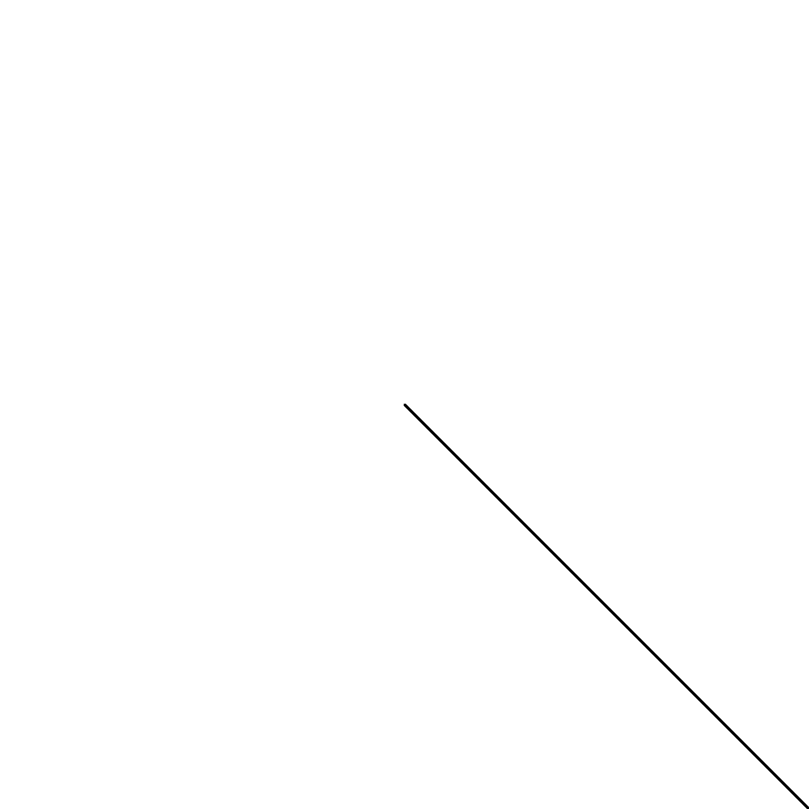
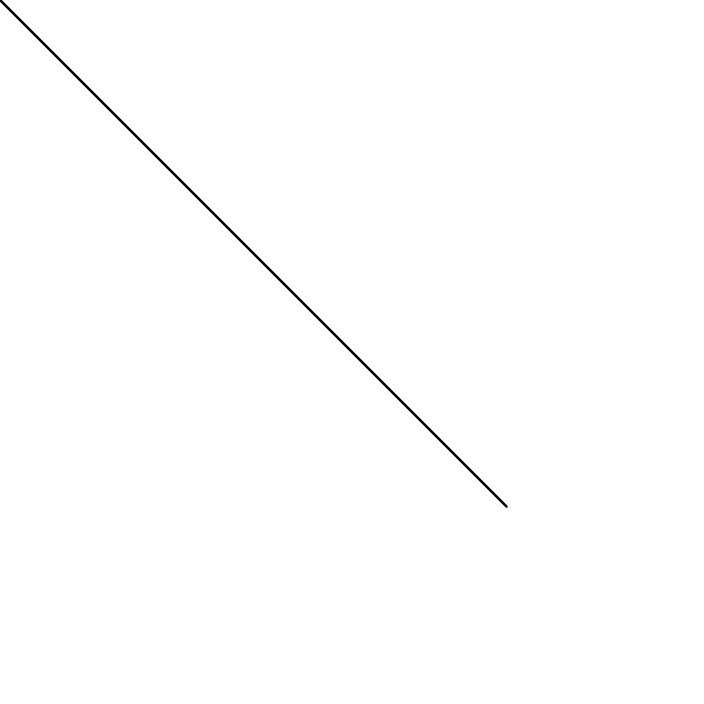
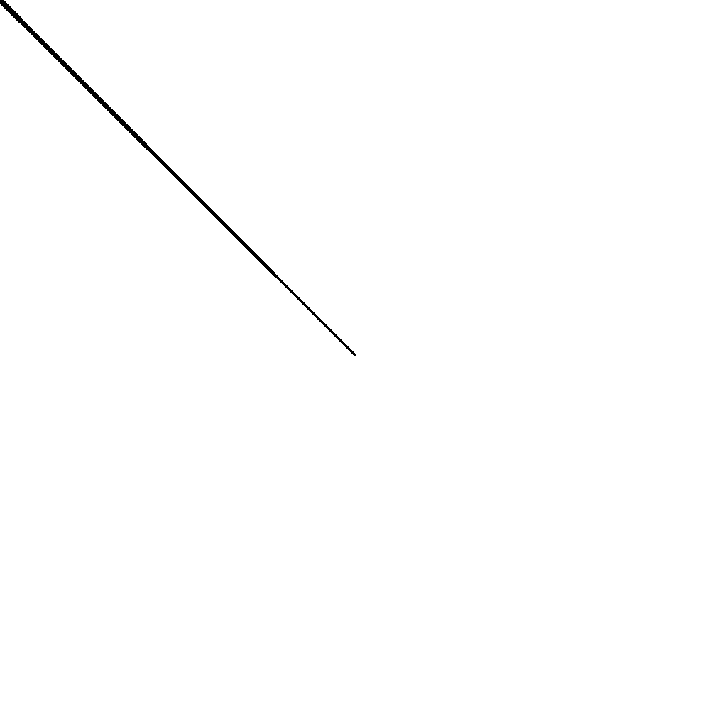
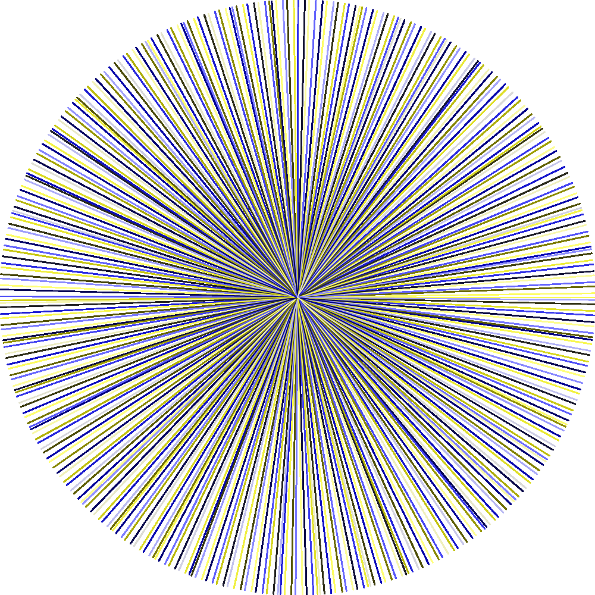
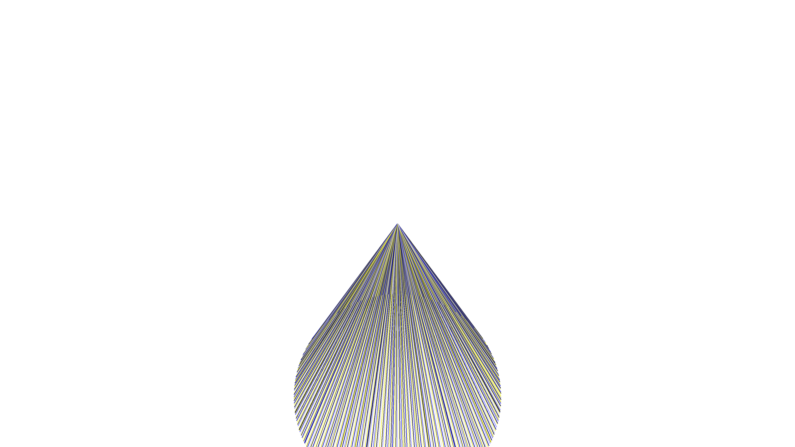
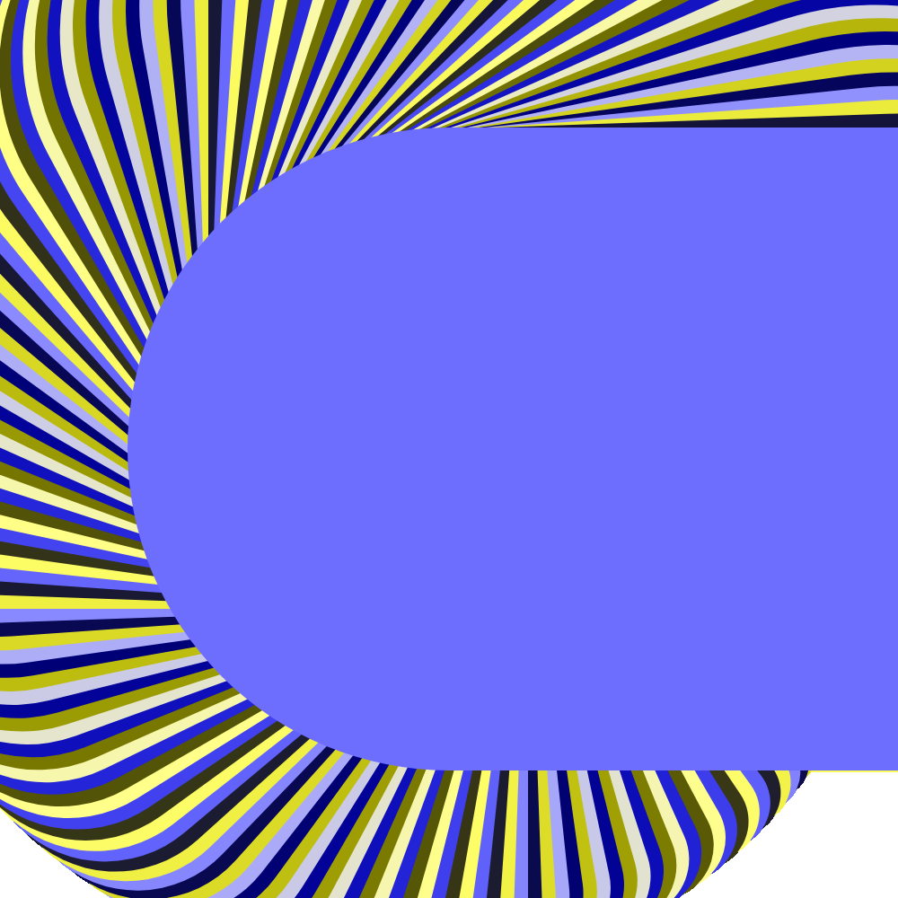
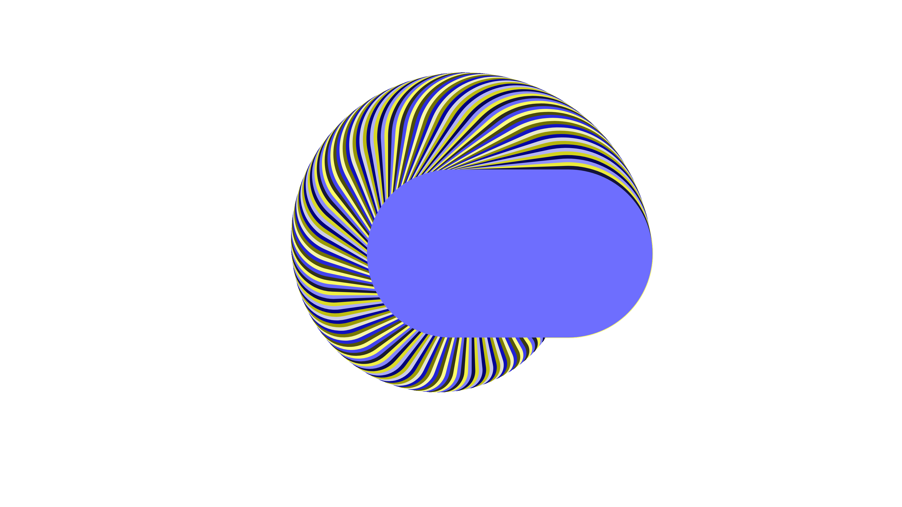

<script>
MathJax = {
  tex: {
    inlineMath: [['$', '$'], ['\\(', '\\)']]
  }
};
</script>
<script id="MathJax-script" async
  src="https://cdn.jsdelivr.net/npm/mathjax@3/es5/tex-chtml.js">
</script>

Lately I've been studying some Linear Algebra and felt like dipping my toes back
into some generative art.

It seems, whenever I start doing something like this my first step is to draw a
circle by radiating spokes from the origin. I always have to sort of rediscover
the math from first principles, so I felt like writing a quick post about it.
I'm going to walk through how I was thinking about this from scratch.

I'm using p5.js for these pictures.

First let's define our canvas:

```javascript
DIM = [500,500];
ORIGIN = DIM.map((el)=>el/2);
```

This is obvious enough. Now, p5.js has two main functions: `setup` and `draw`
which are pretty obvious.

```javascript
function setup() {
  createCanvas(...DIM);
  background(255);
}
```

Color functions take a [variety of arguments][p5color]. In this case, we're
using one argument to define intensity of RGB I guess, 255 is `#FFFFFF`, or all
full RGB or white.

I'm going to do this with only three drawing functions: `line`, which takes an
origin and end point, `strokeWeight`, which defines the line's width, and
`stroke` which defines the line's color.

Let's just get something on screen.

```javascript
function draw() {
  line(...ORIGIN, ...DIM);
}
```

This just draws a line from the center to the bottom right (coordinates are
defined with `(0,0)` at the top left and increasing right and down, as with most
systems).



Okay, now let's try looping over 360 degrees:

```javascript
function draw() {
  for (let i = 0; i <= 360; i++) {
    line(...ORIGIN, i, i);
  }
}
```

This will be hideously wrong, but I start naive. Always.



Okay, we know, obviously, that we're drawing a lot of lines from (0,0,250,250)
to (360,360,250,250) which is pretty meaningless, it's obviously a diagonal line
because `i=i`. Let's try some trigonometry.

We know that every point on the unit circle can be described as a vertex on a
right triangle. Since this triangle is right, getting coordinates with some trig
shouldn't be too hard.

<svg style="display: block; margin: auto;" xmlns="http://www.w3.org/2000/svg" width="410" height="410">
<defs>
<marker id="a" orient="auto" overflow="visible">
<path stroke="#000" stroke-width=".5" d="M-4,0l-2,2 7,-2 -7,-2 2,2z"/>
</marker>
</defs>
<g stroke="#000" stroke-width="3">
<circle cx="195" cy="215" r="169" fill="#f2f2f2" stroke="gray"/>
<path fill="#ddcad4" stroke="purple" d="M215,167a52,52 0 0 1 32,48h-52z"/>
<path marker-end="url(#a)" d="M195,400V15"/>
<path marker-end="url(#a)" d="M10,215h385"/>
<path d="M195 215l65-156"/>
</g>
<g stroke-linecap="round" stroke-width="5">
<path stroke="#3c803f" d="M260 59v156"/>
<path stroke="#2d2f92" d="M195 215h65"/>
</g>
<circle cx="260" cy="59" r="3"/>
<g font-size="26">
<text x="217" y="107">1</text>
<text x="212" y="207" fill="purple" font-style="italic">θ</text>
<text x="267" y="190" fill="#3c8031">sin(<tspan font-style="italic">θ</tspan>)</text>
<text x="200" y="241" fill="#2d2f92">cos(<tspan font-style="italic">θ</tspan>)</text>
</g>
</svg>

This is a classic Unit Circle (sourced from Wikipedia). Every point on the unit
circle can be represented as $(\cos{\theta}, \sin{\theta})$. But $\theta$ is a
radian, so let's do that right.

We know that $360° = 2 \pi$, so translating a degree to a radian as easy:

```javascript
rad = 360 / (2 * Math.PI);
```

Now, let's draw a circle:

```javascript
function draw() {
  rad = 360 / (2 * Math.PI);
  for (let i = 0; i <= 360; i++) {
    line(...ORIGIN,
      Math.cos(i*rad),
      Math.sin(i*rad)
    );
  }
}
```



Well that's not doing it. Let's think about this.

We're definitely converting our $\theta$ from degrees to radians. But now that I
think of it, the output of each of `Math.sin` and `Math.cos` has got to be
$\{\alpha : -1 \leq \theta \leq 1\}$, so we're just drawing a lot of lines from
the origin to a circle around the pixels in the top left corner. Really it's
just a square because it's the top circling around the top pixel and 3 pixels
outside the frame.

So let's recenter to the origin.


```javascript
function draw() {
  rad = 360 / (2 * Math.PI);
  for (let i = 0; i <= 360; i++) {
    line(...ORIGIN,
      ORIGIN[0] + Math.cos(i*rad),
      ORIGIN[0] + Math.sin(i*rad)
    );
  }
}
```


Beautiful, we have a dot. Our radius is 1 pixel, so it's a 2x2 pixel square
around the origin. Let's adjust the radius.

```javascript
function draw() {
  radius = 250;
  rad = 360 / (2 * Math.PI);
  for (let i = 0; i <= 360; i++) {
    line(...ORIGIN,
      ORIGIN[0] + Math.cos(i*rad)*radius,
      ORIGIN[0] + Math.sin(i*rad)*radius
    );
  }
}
```


Hey, we got a circle! Nice.

Technically this is all we needed. But let's try giving it some varied color.
We've got a nice variable `i` right there that describes a circle in 360
degrees. We could use the same sin wave we've already got to give our 3 colors
different degrees. Remember, the outputs of sine and cosine are always between
-1 and 1, so since our color scale is from 0 to 255 we'd basically have just
black lines if we don't normalize our scale to 255.

Since -1*255 is -255, we should move our color scale up to [0,2] by adding 1 to
the output of sine and cosine.

```javascript
s = 1 + Math.sin(i);
c = 1 + Math.cos(i);
```

Then we should scale to 255. We can't just multiply by 255, though, because when
either sine or cosine equal 1, s and c = 2, so $s \cdot 255 = 510$. Let's
instead scale by half of 255, so 127.5.

```javascript
s = (1 + Math.sin(i)) * 127.5;
c = (1 + Math.cos(i)) * 127.5;
```

```javascript
function draw() {
  radius = 250;
  rad = 360 / (2 * Math.PI);
  for (let i = 0; i <= 360; i++) {
    line(...ORIGIN,
      ORIGIN[0] + Math.cos(i*rad)*radius,
      ORIGIN[0] + Math.sin(i*rad)*radius
    );
    s = (1 + Math.sin(i)) * 127.5;
    c = (1 + Math.cos(i)) * 127.5;
    stroke(s, s, c);
  }
}
```



So right here I wanted to start experimenting with size and got a happy accident
I'd like to checkpoint as I was troubleshooting gain. If you just change `DIM`
to `[1920,1080]` you get this:



I'm not fully sure what's going on with that, but I like it. I'm going to
troubleshoot this point.

Fixed:

```javascript
function draw() {
  radius = 250;
  rad = 360 / (2 * Math.PI);
  for (let i = 0; i <= 360; i++) {
    line(...ORIGIN,
      ORIGIN[0] + Math.cos(i*rad)*radius,
      ORIGIN[1] + Math.sin(i*rad)*radius
    );
    s = (1 + Math.sin(i)) * 127.5;
    c = (1 + Math.cos(i)) * 127.5;
    stroke(s, s, c);
  }
}
```

I was actually centering the Y origin on the X origin, which means my origin was
offcentered vertically by $(x/2)-(y/2)$. Good to remember for future
experimentation.

In the meantime, let's mess with some stroke width. First I'm going to refactor
for some clarity (I'm trying to reproduce an effect I got earlier).

Ah, fascinating, I just found a bug: the line defining `rad` is backward. I'm
blowing up the definition of rad. It should read `rad = Math.PI/180;`.

Let's rewrite a bit, and get rid of my bad Python habits:

```javascript
function draw() {
  const radius = 250;
  const rad = Math.PI / 180;
  for (let i = 0; i <= 360; i+=2) {
    let rads = i * rad;
    let xOffset = Math.cos(rads)*radius;
    let yOffset = Math.sin(rads)*radius;
    line(...ORIGIN,
      ORIGIN[0] + xOffset,
      ORIGIN[1] + yOffset
    );
    let s = (1 + Math.sin(i)) * 127.5;
    let c = (1 + Math.cos(i)) * 127.5;
    strokeWeight(i);
    stroke(s, s, c);
  }
}
```

`Math.PI / 180` is the equivalent of $\frac{2 \pi}{360}$.




Well that's a fascinating result. Let's scale it back up to 1920x1080.



Fascinating.

Well, that's it. I just wanted to work through some of the math of programming a
circle.

[p5color]: https://p5js.org/reference/#/p5/color
